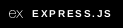

# Environment Setups

                  

- [MERN Project Setup](#mern)
  - [React with NPM](#reactnpm)
  - [React with Yarn](#reactyarn)
  - [Node with NPM](#nodenpm)
  - [Node with Yarn](#nodeyarn)
  - [Node Linting](#nodelint)
  - [Tailwind with Node setup](#nodetailwind)
  - [Material UI with Node setup](#nodemui)
  - [Ant Design with Node setup](#nodeant)
- [VS Code Global Level User Setting](#vs-code)
  - [Steps to follow](#vs-code-steps)
  - [Settings.json](#vs-code-json)
- [LINUX Setup](#linux-setup)

## MERN Project Setup <a name="mern"></a>

### React Js Setup

##### React with NPM <a name="reactnpm"></a>

- Create App:

  ```bash
  npm create vite@latest
  ```

- Get inside the project directory.
- Install node-modules:

  ```bash
  npm i
  ```

- Run App:

  ```bash
  npm run dev
  ```

##### React with Yarn <a name="reactyarn"></a>

- Create App:

  ```bash
  yarn create vite
  ```

- Get inside the project directory.
- Install node-modules:

  ```bash
  yarn
  ```

- Run App:

  ```bash
  yarn dev
  ```

### Node Js Setup

##### Node with NPM <a name="nodenpm"></a>

- Create project folder:

  ```bash
  mkdir <folder-name>
  ```

- Create Node project:

  ```bash
  npm init
  ```

- Install node-modules:

  ```bash
  npm i
  ```

##### Node with Yarn <a name="nodeyarn"></a>

- Create project folder:

  ```bash
  mkdir <folder-name>
  ```

- Create Node project:

  ```bash
  yarn init
  ```

- Install node-modules:

  ```bash
  yarn
  ```

### Linting Node <a name="nodelint"></a>

- Run the commands NPM:

  ```bash
  npm i -D prettier
  npx install-peerdeps --dev eslint-config-airbnb
  npm i -D eslint eslint-config-prettier eslint-plugin-prettier eslint-plugin-react
  ```

- Run the commands Yarn:

  ```bash
  yarn add -D prettier
  npx install-peerdeps --dev eslint-config-airbnb
  yarn add -D eslint eslint-config-prettier eslint-plugin-prettier eslint-plugin-react
  ```

- Create a file ```.eslintrc.json``` file in the project root and Copy-Paste the below contents:

  ```json
  {
    "extends": ["prettier", "airbnb-base"],
    "parserOptions": {
      "ecmaVersion": 12
    },
    "env": {
      "commonjs": true,
      "node": true
    },
    "rules": {
      "no-console": 0,
      "indent": 0,
      "linebreak-style": 0,
      "prettier/prettier": [
        "error",
        {
          "trailingComma": "es5",
          "singleQuote": true,
          "printWidth": 100,
          "tabWidth": 4,
          "semi": true
        }
      ]
    },
    "plugins": ["prettier"]
  }
  ```

  Note: Now, this app can be run on the localhost by following Run App instructions but if there any error arrives, most probably it will be generated because of the eslint, try to lint all the files by saving each them or solve the errors by following the given error reports on the terminal!

### Tailwind CSS with Node Setup <a name="nodetailwind"></a>

- Run the commands NPM:

  ```bash
  npm install -D tailwindcss postcss autoprefixer
  npx tailwindcss init -p
  ```

- Run the commands Yarn:

  ```bash
  yarn add -D tailwindcss postcss autoprefixer
  npx tailwindcss init -p
  ```

- Configure your template paths:
  Add the paths to all of your template files in your ```tailwind.config.js``` file.

  ```js
  content: [
    "./index.html",
    "./src/**/*.{js,ts,jsx,tsx}",
  ]
  ```

- Add the Tailwind directives to your CSS:
  Add the ```@tailwind``` directives for each of Tailwind’s layers to your ```./src/index.css``` file.

  ```css
  @tailwind base;
  @tailwind components;
  @tailwind utilities;
  ```

### Material UI with Node setup <a name="nodemui"></a>

- Run the commands NPM:

  ```bash
  npm install @mui/material @emotion/react @emotion/styled
  npm install @fontsource/roboto
  npm install @mui/icons-material
  ```

- Run the commands Yarn:

  ```bash
  yarn add @mui/material @emotion/react @emotion/styled
  yarn add @fontsource/roboto
  yarn add @mui/icons-material
  ```

- Import Roboto fonts:

  ```js
  import '@fontsource/roboto/300.css';
  import '@fontsource/roboto/400.css';
  import '@fontsource/roboto/500.css';
  import '@fontsource/roboto/700.css';
  ```

Note: react and react-dom are peer dependencies, meaning you should ensure they are installed before installing Material UI.

### Ant Design with Node setup <a name="nodeant"></a>

- Run the commands NPM:

  ```bash
  npm install antd --save
  ```

- Run the commands Yarn:

  ```bash
  yarn add antd
  ```

## VS Code Global Level User Setting [setting.json] <a name="vs-code"></a>

### Steps to follow <a name="vs-code-steps"></a>

- Open VS Code.

- Go to Settings Or, press `Ctrl + ,`.

- Click on the 3rd Icon from Top Right Side, named: `Open Settings (JSON)`.

- Copy-Paste the below settings.json.

- Font Installation: `FIRA CODE` (needs to installed to use).

  ```bash
  sudo dnf install fira-code-fonts
  ```

### Settings.json <a name="vs-code-json"></a>

```json
{
  // editor
  "editor.fontSize": 16,
  "editor.fontFamily": "Fira Code, Consolas, Courier New, monospace",
  "editor.fontLigatures": true,
  "editor.wordWrap": "on",
  "editor.minimap.enabled": false,
  "editor.suggestSelection": "first",
  "editor.guides.bracketPairs": true,
  "editor.bracketPairColorization.enabled": true,
  "editor.quickSuggestions": {
    "strings": true
  },
  "editor.tokenColorCustomizations": {
    "textMateRules": [
      {
        "scope": "comment",
        "settings": {
          "foreground": "#999999",
          "fontStyle": "italic"
        }
      }
    ]
  },
  "files.autoSave": "afterDelay",
  "files.autoSaveDelay": 500,

  // cursor
  "editor.cursorSmoothCaretAnimation": "on",
  "editor.cursorBlinking": "expand",

  //terminal
  "terminal.integrated.fontSize": 16,
  "terminal.integrated.cursorStyle": "line",
  "terminal.integrated.fontWeight": "normal",
  "terminal.integrated.cursorBlinking": true,
  "terminal.integrated.fontFamily": "Fira Code, Consolas, Courier New, monospace",

  // workbench customization
  "workbench.colorTheme": "Omni",
  "workbench.iconTheme": "material-icon-theme",
  "workbench.colorCustomizations": {
    "editorCursor.foreground": "#ffff00",
    "terminal.background": "#1A1824",
    "terminal.foreground": "#DEE0F4",
    "terminalCursor.background": "#1A1824",
    "terminalCursor.foreground": "#D9D8EF",
    "terminal.ansiBlack": "#171421",
    "terminal.ansiBlue": "#12488B",
    "terminal.ansiBrightBlack": "#171421",
    "terminal.ansiBrightBlue": "#2AA1B3",
    "terminal.ansiBrightCyan": "#8BA59B",
    "terminal.ansiBrightGreen": "#26A269",
    "terminal.ansiBrightMagenta": "#A347BA",
    "terminal.ansiBrightRed": "#FB543F",
    "terminal.ansiBrightWhite": "#D0CFCC",
    "terminal.ansiBrightYellow": "#A2734C",
    "terminal.ansiCyan": "#2AA1B3",
    "terminal.ansiGreen": "#26A269",
    "terminal.ansiMagenta": "#A347BA",
    "terminal.ansiRed": "#FB543F",
    "terminal.ansiWhite": "#D0CFCC",
    "terminal.ansiYellow": "#A2734C"
  },

  //  Debug Console
  "debug.console.fontSize": 16,

  // Code Runner [Extension Settings]
  "code-runner.runInTerminal": true,
  "code-runner.saveFileBeforeRun": true,
  "code-runner.clearPreviousOutput": true,

  // Live Server [Extension Settings]
  "liveServer.settings.root": "/",
  "liveServer.settings.donotShowInfoMsg": true,

  // Snipped (Screenshot) [Extension Settings]
  "snipped.enablePng": true,

  // Better Comments [Extension Settings]
  "better-comments.tags": [
    {
      "tag": "!",
      "color": "#FF2D00", // !Red
      "strikethrough": false,
      "underline": false,
      "backgroundColor": "transparent",
      "bold": false,
      "italic": false
    },
    {
      "tag": "?",
      "color": "#3498DB", // ?Blue
      "strikethrough": false,
      "underline": false,
      "backgroundColor": "transparent",
      "bold": false,
      "italic": false
    },
    {
      "tag": "//",
      "color": "#ffffff", // //White
      "strikethrough": true,
      "underline": false,
      "backgroundColor": "transparent",
      "bold": false,
      "italic": false
    },
    {
      "tag": "todo",
      "color": "#FF8C00", // todo Orange
      "strikethrough": false,
      "underline": false,
      "backgroundColor": "transparent",
      "bold": false,
      "italic": false
    },
    {
      "tag": "*",
      "color": "#FFD700", // *Golden
      "strikethrough": false,
      "underline": false,
      "backgroundColor": "transparent",
      "bold": false,
      "italic": false
    },

    {
      "tag": "^",
      "color": "#FF1493", // ^Pink
      "strikethrough": false,
      "underline": false,
      "backgroundColor": "transparent",
      "bold": false,
      "italic": false
    }
  ],

  // Code Spell Checker [Extension Settings]
  "cSpell.userWords": [
    "ALLARR",
    "Aritra",
    "Arsh",
    "autoboxing",
    "binpow",
    "Brijmohan",
    "cerr",
    "Choudhary",
    "CHOUDHURY",
    "chrono",
    "Cinetro",
    "classpath",
    "Cloneable",
    "Consolas",
    "cout",
    "cpptools",
    "donot",
    "endl",
    "esbenp",
    "factorypath",
    "Filmingg",
    "Filmistry",
    "Fira",
    "Flowbite",
    "FMCG",
    "fontkit",
    "FORC",
    "FORN",
    "FORSQ",
    "freopen",
    "Gaurav",
    "Glassmorphism",
    "GYMYAM",
    "harshad",
    "imax",
    "imdb",
    "imin",
    "INFF",
    "Intellicode",
    "isit",
    "istream",
    "krishnamurthy",
    "llmax",
    "llmin",
    "LLONG",
    "loopc",
    "loopn",
    "lsum",
    "maxl",
    "maxll",
    "maxv",
    "memset",
    "minll",
    "minv",
    "Mohan",
    "ondataavailable",
    "ostream",
    "Playfair",
    "Quokka",
    "REVERSEARR",
    "revloop",
    "RFOR",
    "rloop",
    "rsum",
    "Screno",
    "Screnoo",
    "semibold",
    "SORTARR",
    "stdc",
    "Subarray",
    "swal",
    "sweetalert",
    "tailwindcss",
    "TANMOY",
    "tribonacci",
    "tsum",
    "vect",
    "Vikrant",
    "VPII",
    "vpll",
    "vsintellicode",
    "xorr",
    "xtra"
  ],

  // Tailwind CSS
  "tailwindCSS.emmetCompletions": true,
  "tailwindCSS.includeLanguages": {
    "html": "html",
    "javascript": "javascript",
    "css": "css"
  },

  "C_Cpp.files.exclude": {
    "**/.vscode": true,
    "**/.vs": true
  },

  // Error Lens
  "errorLens.followCursor": "allLines",

  // Disables all built-in syntax checking
  "javascript.validate.enable": false,

  // Emmets
  "emmet.triggerExpansionOnTab": true,
  "emmet.includeLanguages": {
    "javascript": "javascriptreact"
  },

  // Code Formatting
  "editor.detectIndentation": false,
  "editor.tabSize": 2,
  "prettier.proseWrap": "always",
  "editor.defaultFormatter": "esbenp.prettier-vscode",
  "editor.formatOnSave": true,
  "[javascript]": {
    "editor.formatOnSave": false,
    "editor.defaultFormatter": null
  },
  "[javascriptreact]": {
    "editor.formatOnSave": false,
    "editor.defaultFormatter": null
  },
  "[c]": {
    "editor.defaultFormatter": "xaver.clang-format"
  },
  "[objective-c]": {
    "editor.defaultFormatter": "xaver.clang-format"
  },
  "[cpp]": {
    "editor.wordBasedSuggestions": "off",
    "editor.suggest.insertMode": "replace",
    "editor.semanticHighlighting.enabled": true,
    "editor.defaultFormatter": "xaver.clang-format"
  },
  "[java]": {
    "editor.defaultFormatter": "xaver.clang-format"
  },
  "editor.codeActionsOnSave": {
    "source.fixAll.eslint": "always",
    "source.fixAll.tslint": "always",
    "source.organizeImports": "always"
  },
  "css.lint.unknownAtRules": "ignore",

  // C++ Intellisense [Extension Settings]
  "vsintellicode.modify.editor.suggestSelection": "automaticallyOverrodeDefaultValue",
  "C_Cpp.default.intelliSenseMode": "linux-gcc-x64",

  // File Exclusion
  "files.exclude": {
    "**/.classpath": true,
    "**/.factorypath": true,
    "**/.git": false,
    "**/.project": true,
    "**/.settings": true
  }
}
```

## Linux Setup <a name="linux-setup"></a>

- Speed up DNF:

  ```bash
  echo 'fastestmirror=1' | sudo tee -a /etc/dnf/dnf.conf
  echo 'max_parallel_downloads=10' | sudo tee -a /etc/dnf/dnf.conf
  ```

- Terminal Customization:

  ```bash
  sudo dnf install zsh
  sh -c "$(curl -fsSL https://raw.githubusercontent.com/ohmyzsh/ohmyzsh/master/tools/install.sh)"
  git clone https://github.com/zsh-users/zsh-autosuggestions.git $ZSH_CUSTOM/plugins/zsh-autosuggestions
  git clone https://github.com/denysdovhan/spaceship-prompt.git "$ZSH_CUSTOM/themes/spaceship"
  touch ~/.config/spaceship.zsh
  ```

  - Go to /home/.zshrc:
    - Line no 12:

    ```bash
    source "/home/tanmoy_og/.oh-my-zsh/custom/themes/spaceship/spaceship.zsh"
    ```

    - Line no 74:
    add ```zsh-autosuggestions``` after ```git```
  - Go to home/.config/spaceship.zsh:

    ```txt
    # Display time
    SPACESHIP_TIME_SHOW=false

    # Display username
    SPACESHIP_USER_SHOW=false

    # Display package
    SPACESHIP_PACKAGE_SHOW=false

    # Do not truncate path in repos
    SPACESHIP_DIR_TRUNC_REPO=true

    # Add custom Ember section
    # See: https://github.com/spaceship-prompt/spaceship-ember
    spaceship add ember

    # Add a custom vi-mode section to the prompt
    # See: https://github.com/spaceship-prompt/spaceship-vi-mode
    spaceship add --before char vi_mode

    SPACESHIP_PROMPT_ADD_NEWLINE=true
    SPACESHIP_PROMPT_SEPARATE_LINE=true
    SPACESHIP_PROMPT_FIRST_PREFIX_SHOW=false
    SPACESHIP_RPROMPT_FIRST_PREFIX_SHOW=false
    SPACESHIP_PROMPT_PREFIXES_SHOW=false
    SPACESHIP_PROMPT_SUFFIXES_SHOW=true

    # SPACESHIP_<SECTION>_<OPTION>
    #  SPACESHIP_PACKAGE_PREFIX="via·"
    #  SPACESHIP_PACKAGE_SUFFIX=" "
    #  SPACESHIP_PACKAGE_COLOR="yellow"

    SPACESHIP_PROMPT_ORDER=(
      time           # Time stamps section
      user           # Username section
      dir            # Current directory section
      host           # Hostname section
      git            # Git section (git_branch + git_status)
      hg             # Mercurial section (hg_branch  + hg_status)
      package        # Package version
      node           # Node.js section
      bun            # Bun section
      deno           # Deno section
      ruby           # Ruby section
      python         # Python section
      elm            # Elm section
      elixir         # Elixir section
      xcode          # Xcode section
      swift          # Swift section
      golang         # Go section
      perl           # Perl section
      php            # PHP section
      rust           # Rust section
      haskell        # Haskell Stack section
      scala          # Scala section
      kotlin         # Kotlin section
      java           # Java section
      lua            # Lua section
      dart           # Dart section
      julia          # Julia section
      crystal        # Crystal section
      docker         # Docker section
      docker_compose # Docker section
      aws            # Amazon Web Services section
      gcloud         # Google Cloud Platform section
      azure          # Azure section
      venv           # virtualenv section
      conda          # conda virtualenv section
      dotnet         # .NET section
      ocaml          # OCaml section
      vlang          # V section
      zig            # Zig section
      purescript     # PureScript section
      erlang         # Erlang section
      kubectl        # Kubectl context section
      ansible        # Ansible section
      terraform      # Terraform workspace section
      pulumi         # Pulumi stack section
      ibmcloud       # IBM Cloud section
      nix_shell      # Nix shell
      gnu_screen     # GNU Screen section
      exec_time      # Execution time
      async          # Async jobs indicator
      line_sep       # Line break
      battery        # Battery level and status
      jobs           # Background jobs indicator
      exit_code      # Exit code section
      sudo           # Sudo indicator
      char           # Prompt character
    )
    ```

  - Exit console and log out, enter again.
    Or
    Run ```source ~/.zshrc```
  
- Dependencies:

  ```bash
  sudo dnf install gcc-c++

  dnf search openjdk
  sudo dnf install <openjdk-package-name>

  sudo dnf install nodejs
  sudo npm install npm@latest -g
  sudo npm cache clean -f
  sudo npm install -g n
  n lts

  sudo npm install -g yarn
  yarn set version latest
  ```

- Fonts:

  ```bash
  sudo dnf copr enable dawid/better_fonts -y
  sudo dnf install fontconfig-font-replacements -y
  sudo dnf install fontconfig-enhanced-defaults -y
  sudo dnf install fira-code-fonts
  ```

- App downloads with Package Manager:

  ```bash
  sudo dnf install https://mirrors.rpmfusion.org/free/fedora/rpmfusion-free-release-$(rpm -E %fedora).noarch.rpm https://mirrors.rpmfusion.org/nonfree/fedora/rpmfusion-nonfree-release-$(rpm -E %fedora).noarch.rpm

  sudo dnf copr enable the4runner/firefox-dev

  sudo dnf install fedora-workstation-repositories
  sudo dnf config-manager --set-enabled google-chrome

  sudo dnf install dnf-plugins-core
  sudo dnf config-manager --add-repo https://brave-browser-rpm-beta.s3.brave.com/brave-browser-beta.repo
  sudo rpm --import https://brave-browser-rpm-beta.s3.brave.com/brave-core-nightly.asc

  sudo rpm --import https://packages.microsoft.com/keys/microsoft.asc
  sudo sh -c 'echo -e "[code]\nname=Visual Studio Code\nbaseurl=https://packages.microsoft.com/yumrepos/vscode\nenabled=1\ngpgcheck=1\ngpgkey=https://packages.microsoft.com/keys/microsoft.asc" > /etc/yum.repos.d/vscode.repo'

  wget https://repo.protonvpn.com/fedora-39-stable/protonvpn-stable-release/protonvpn-stable-release-1.0.1-2.noarch.rpm

  sudo dnf check-update && dnf update && dnf upgrade --refresh

  sudo dnf install -y code vlc gimp gparted gnome-tweak-tool timeshift dnfdragora bleachbit firefox-dev google-chrome-stable brave-browser-beta deluge gThumb komikku

  sudo dnf install ./protonvpn-stable-release-1.0.1-2.noarch.rpm
  sudo dnf install --refresh proton-vpn-gnome-desktop
  sudo dnf install libappindicator-gtk3 gnome-shell-extension-appindicator gnome-extensions-app

  sudo dnf check-update && dnf upgrade

  cd ~/.local/share && wget https://mullvad.net/en/download/browser/linux-x86_64/latest -O mullvad-browser.tar.xz
  tar -xvf mullvad-browser.tar.xz mullvad-browser
  rm mullvad-browser.tar.xz && cd mullvad-browser && ./start-mullvad-browser.desktop --register-app
  ```

- App downloads with Flatpaks/Flathubs:
  - Bitwarden
  - Cryptomator
  - Discord
  - Zoom
  - Ferdium
  - Flatseal
  - Obsidian
  - Typora
  - Video Trimmer
  - Eye Dropper
  - Draw. io
  - Foliate
  - Floorp
  - Stremio
  - Junction
  - Nuclear / Spotube
